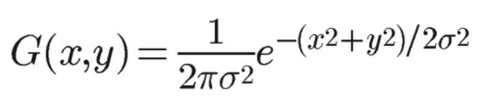
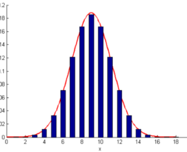

# blur

使用的公式：



```
float a = (float) ((1.0f / 2.0f * Math.PI * Math.pow(sigma, 2.0f)) *
        Math.exp(-s / (2.0f * Math.pow(sigma, 2.0f))));
```

正太间的总和是1，每个地方的分布为各个部分除以总的。

```
for (int x = 0; x < tx*tx; ++x) {
    gaussianWeights[x] = gaussianWeights[x]/sumOfWeights;
}
```

现在算是完成了。

、

glsl

```
for (int i = -blurRadius; i <= blurRadius; i++) {
    for (int j = -blurRadius; j <= blurRadius; j++) {
        highp float weight = gaussianWeights[x];
        sum += (texture2D(sTexture, vTexCoord+offset*vec2(i,j))*weight);
        x++;
    }
}
```


使用一个framebuffer奇奇怪怪的，也完全没有必要
